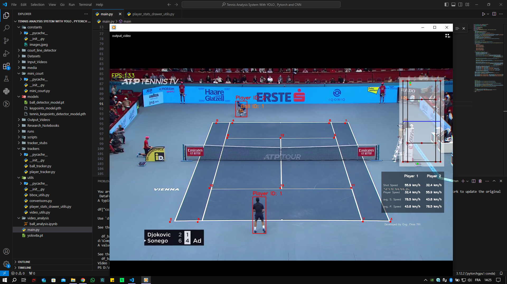

# Tennis Video Analysis System With YOLO, PyTorch, and CNN

🎾 Excited to share my latest project - Tennis Video Analysis System With YOLO, PyTorch, and CNN! 🚀

I've developed an innovative solution that analyzes tennis players in videos to measure their speed, ball shot speed, and number of shots. Using YOLO from Ultralytics and Roboflow for player and tennis ball detection, along with a CNN developed by PyTorch for court keypoint extraction, Pandas for calculating statistics of player movement speed, ball shot speed, and number of shots, and OpenCV for presenting those statistics on the video, this project delivers accurate insights into player performance.

## Project Overview
This project goes beyond traditional video analysis. By leveraging state-of-the-art technologies like YOLO, PyTorch, and CNNs, it provides detailed insights into tennis player performance, helping players and coaches make data-driven decisions to improve their game.

## Output Showcase
Witness the power of this system with real-time statistics overlaid on the video, offering a comprehensive view of player dynamics and shot analysis

## Watch The Output 

## Key Technologies Used
- YOLO from Ultralytics and Roboflow for precise player and tennis ball detection
- PyTorch CNN for robust tennis court keypoint extraction
- Pandas for calculating and analyzing player movement speed, ball shot speed, and shot count
- OpenCV for presenting statistical insights on the video

## Data-Driven Insights
With detailed statistics on player movements, shot speed, and frequency, this system empowers players and coaches to identify strengths and weaknesses, refine strategies, and enhance overall performance.

## Training
* Tennis ball detector with YOLO: Research_Notebooks/Ball_Detector.ipynb
* Tennis court keypoint with Pytorch: Research_Notebooks/Tennis_Court_Points_Detector.ipynb

## Requirements
- Python 3.8
- Ultralytics
- PyTorch
- Pandas
- NumPy
- OpenCV
